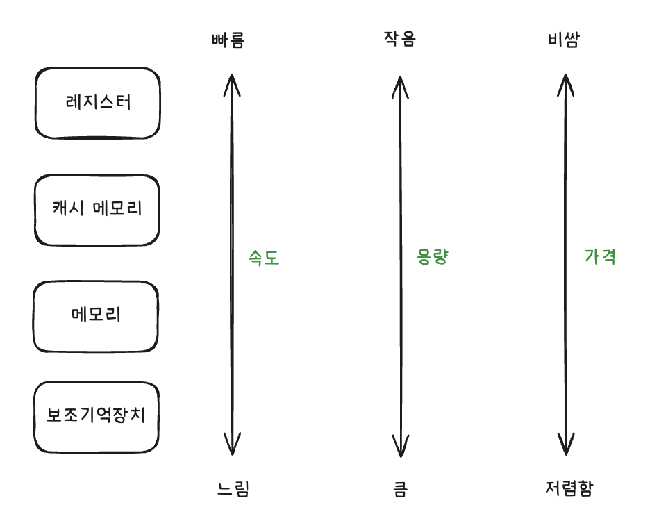
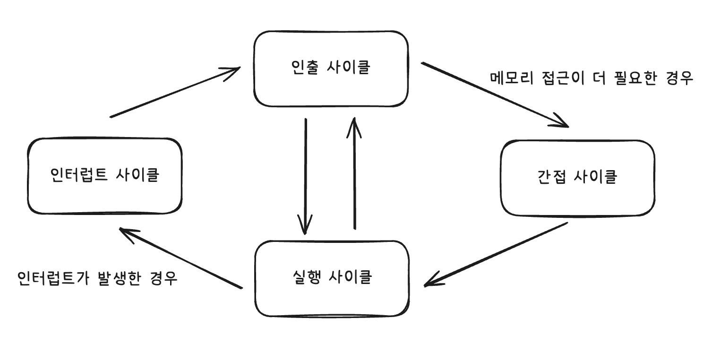

# 1. 컴퓨터 구조의 큰 그림

## 컴퓨터가 이해하는 정보

- 컴퓨터가 이해할 수 있는 정보 : 데이터, 명령어

- 데이터는 명령어에 종속적인 정보, 명령의 대상, 명령어의 재료이다.

- 명령어를 실행하는 주체 : CPU

- CPU의 종류에 따라 실행 가능한 세부적인 명령어의 종류와 처리의 양상의 달라질 수 있다.

## 컴퓨터의 핵심 부품

- CPU(중앙처리장치), 메모리(주기억장치), 캐시 메모리, 보조기억장치, 입출력장치

### CPU (Central Processing Unit)

- 데이터와 명령어를 읽어들이고, 해석하고, 실행하는 부품

CPU의 주요 구성 요소

- 산술논리연산장치(ALU, Arithmetic and Login Unit)

  - 연산을 수행할 회로로 구성되어 있는 일종의 계산기

  - CPU가 처리할 명령어를 실질적으로 연산한다.

- 제어장치(CU, Control Unit)

  - 명령어를 해석해 제어 신호를 내보내는 장치

  - 제어 신호 : 부품을 작동시키기 위한 신호

- 레지스터 (register)

  - CPU 내부의 작은 임시 저장 장치

  - CPU가 처리하는 명령어는 레지스터에 저장되어서

    레지스터 값만 관찰해도 프로그램이 어떻게 실행되는지 알 수 있다.

### 메모리와 캐시 메모리

- 보통 메모리를 RAM으로 지칭한다.

- 메모리 : 현재 실행 중인 프로그램을 구성하는 데이터와 명령어를 저장하는 부품

- 프로그램이 실행되려면 그 프로그램이 이루는 데이터와 명령어가 메모리에 저장되어야 한다.

- CPU가 원하는 정보로 접근하기 위해서 **주소**가 필요하다.

- **휘발성**은 전원이 공급되지 않을 때, 저장하고 있는 정보가 지워지는 특성을 의미한다.

  - 메모리(RAM)은 휘발성 저장장치라 전원이 꺼지면 메모리에 저장된 정보가 모두 삭제된다.

- 캐시 메모리 (Cache Memory)

  - CPU가 조금이라도 더 빨리 메모리에 저장된 값에 접근하기 위해 사용하는 저장장치

  - CPU와 메모리 사이에는 반드시 하나 이상의 캐시 메모리가 존재한다.

  - CPU 안에 위치하기도 하고, 밖에 위치하기도 하며 여러 종류가 있다.

### 보조기억장치

- 전원이 꺼져도 저장된 정보가 사라지지 않는 **비휘발성** 저장 장치

- ex) 하드 디스크 드라이브, SSD, USB, SD 카드

- CPU가 보조기억장치에 저장된 프로그램을 실행하려면 메모리로 복사해야 한다.

### 입출력장치

- 컴퓨터 외부에 연결되어 컴퓨터 내부와 정보를 교환하는 장치

  - 입력장치 : 마우스, 키보드

  - 출력장치 : 스피커, 모니터, 프린터

### 메인 보드와 버스

- 메인보드에는 컴퓨터의 핵심 부품을 비롯한 여러 부품들을 연결할 수 있는 슬롯과 연결 단자들이 있다.

- 버스 : 각 컴퓨터 부품들이 정보를 주고받는 통로

### 저장장치의 계층 구조

- CPU와 가까운 순

: 레지스터 -> 캐시 메모리 -> 메모리 -> 보조기억장치

 

# 2. 컴퓨터가 이해하는 정보

## 데이터 - 0과 1로 숫자 표현하기

## 데이터 - 0과 1로 문자 표현하기

## 명령어

### 기계어와 어셈블리어

- 기계어 : CPU가 이해할 수 있도록 0과 1로 표현된 정보를 있는 그대로 표현한 언어

- 어셈블리어 : 0과 1로 표현된 기계어를 읽기 편한 형태로 단순 번역한 언어

### 명령어 사이클

- CPU가 명령어를 처리하는 과정에서 프로그램 속 각각의 명령어들은 일정한 주기를 반복하며 실행된다.

- 사이클 순서

  1. 인출 사이클

  - 메모리에 있는 명령어를 CPU로 가지고 오는 단계

  2. 실행 사이클

  - CPU로 가져온 명령어를 실행하는 단계

  - CPU는 메모리 속 명령어를 가져와 실행하고, 가져와 실행하기를 반복한다. (인출, 실행 반복)

  3. 간접 사이클

  - 명령어를 실행하기 위해 한 번 더 메모리에 접근하는 단계

  - 오퍼랜드 필드에 메모리 주소가 명시된 경우, 한 번 더 메모리에 접근해야 한다.

  4. 인터럽트 사이클

  - 인터럽트 사이클을 이해하려면 CPU 레지스터에 대한 이해가 선행되어야 한다.

 

# 3. CPU

## 레지스터

CPU 안에 있는 작은 임시 저장장치

### 1. 프로그램 카운터 (PC, Program Counter)

- 메모리에서 다음으로 읽어 들일 명령어의 주소를 저장한다.

### 2. 명령어 레지스터 (IR, Instruction Register)

- 해석할 명령어, 즉 메모리에서 방금 읽어 들인 명령어를 저장하는 레지스터

### 3. 범용 레지스터 (general purpose register)

- 다양하고 일반적인 상황에서 자유롭게 사용할 수 있는 레지스터

### 4. 플래그 레지스터 (flag register)

- 연산의 결과 혹은 CPU 상태에 대한 부가 정보인 플래그 (flag) 값을 저장하는 레지스터

### 5. 스택 포인터 (stack pointer)

- 메모리 내 스택 영역의 최상단 스택 데이터 위치를 가리키는 특별한 레지스터

## 인터럽트

- CPU의 작업을 방해하는 신호

- 종류 : 동기 인터럽트 / 비동기 (하드웨어) 인터럽트

  - 동기 인터럽트

    CPU에 의해 발생하는 인터럽트

    프로그래밍 오류와 같은 예외적인 상황을 마주쳤을 때 발생하는 인터럽트. 예외 라고도 부른다.

  - 비동기 인터럽트

    입출력장치에 의해 발생하는 인터럽트 (알림 역할)

    - CPU 명령 자체에서 인터럽트가 발생할 경우 : 동기

    - 외부에서 유입될 경우 : 비동기

### 하드웨어 인터럽트

- CPU는 효율적으로 명령어를 처리하기 위해 하드웨어 인터럽트를 사용한다.

- **하드웨어 입터럽트**는 입출력 완료 여부를 확인하기 위한 CPU 사이클 낭비를 최소화하고, CPU가 다른 일을 수행할 수 있는 시간을 벌어 줌으로써 효율적으로 명령어를 처리할 수 있도록 돕는다.

- CPU가 하드웨어 인터럽트를 처리하는 순서

  1. 입출력장치는 CPU에게 인터럽트 요청 신호를 보냄

  2. CPU는 실행 사이클이 끝나고 명령어를 인출하기 전에 항상 인터럽트 여부를 확인

  3. CPU는 인터럽트 요청을 확인하고, 인터럽트 플래그를 통해 현재 인터럽트를 받아들일 수 있는지 여부를 확인

  4. 인터럽트를 받아들일 수 있다면 CPU가 지금까지의 작업을 백업

  5. CPU는 인터럽트 벡터를 참조하여 인터럽트 서비스 루틴을 실행

  6. 인터럽트 서비스 루틴 실행이 끝나면 4에서 백업해 둔 작업을 복구하여 실행을 재개

  - 인터럽트 요청 신호

    : 인터럽트하기 전에 CPU에게 인터럽트의 기능 여부를 확인하는 신호

  - 인터럽트 플래그

    : 하드웨어 인터럽트를 받아들일지, 무시할 지를 결정하는 플래그. 불가능으로 설정되면 CPU는 인터럽트 요청이 오더라도 무시함.

  - 하드웨어 인터럽트에는 인터럽트 플래그로 **막을 수 있는 인터럽트**와 **막을 수 없는 인터럽트(NMI, non maskable interrupt)**가 있다.

  - 인터럽트 서비스 루틴 (ISR)

    : 인터럽트를 처리하기 위한 프로그램으로, 어떤 인터럽트가 발생했을 때 해당 인터럽트를 어떻게 처리하고 작동해야 할지에 대한 정보로 이루어진 프로그램이다.

    인터럽트 핸들러로도 부른다.

  - 인터럽트 백터 : 인터럽트 서비스 루틴을 식별하기 위한 정보.

  - **CPU가 인터럽트를 처리한다**

    : 인터럽트 서비스 루틴을 실행하고, 본래 수행하던 작업으로 다시 되돌아온다.

    CPU가 인터럽트 서비스 루틴을 실행할 때, 인터럽트 백터를 통해 인터럽트 서비스 루틴의 시작 주소를 알 수 있다.

### **인터럽트를 처리하는 인터럽트 사이클**까지 추가한 명령어 사이클 모습

- CPU는 이와 같은 과정을 반복하며 프로그램을 실행해나간다.

 

### 예외 (동기 인터럽트)

- CPU 명령 실행 중 발생하는 예외 상황을 의미한다.

- 종류 : 폴트, 트랩, 중단, 소프트웨어 인터럽트

  - 폴트

    예외를 처리한 직후에 예외가 발생한 명령어부터 실행을 재개하는 예외

  - 트랩

    예외를 처리한 직후에 예외가 발생한 명렁어의 다음 명령어부터 실행을 재개하는 예외 (예 : 디버깅의 브레이크 포인트 )

  - 중단

    CPU가 실행 중인 프로그램을 강제로 중단시킬 수 밖에 없는 심각한 오류를 발견했을 때 발생하는 예외

  - 소프트웨어 인터럽트

    시스템 콜이 발생했을 때 발생하는 예외

 

## CPU 성능 향상을 위한 설계

### CPU 클럭 속도

- **클럭** : 컴퓨터의 부품을 일사불란하게 움직일 수 있게 하는 시간의 단위

- 클럭 속도 = CPU의 속도

- 클럭 속도를 필요 이상으로 높이면 발열이 심해져서 클럭 속도를 높이는 것만으로 CPU의 성능을 높이는 데에는 한계가 있다.

### 멀티코어와 멀티스레드

- 클럭 속도를 높이는 방법 이외 코어 수 혹은 스레드 수를 늘리는 방법으로 CPU의 성능을 높일 수 있다.

- **코어** : CPU 내에서 명령어를 읽어 들이고, 해석하고, 실행하는 부품

- **스레드** : 실행 흐름의 단위

  - 하드웨어 스레드

    : 하나의 코어가 동시에 처리하는 명령어의 단위. **논리 프로세서** 라고도 부른다.

    - 멀티스레드 프로세서/CPU : 하나의 코어로 여러 명령어를 동시에 처리하는 CPU

      - 1코어 1스레드 CPU

        명령어를 읽고, 해석하고, 실행하는 부품 1개가 한 번에 하나의 명령어를 처리

      - 2코어 4스레드 CPU

        명령어를 읽고, 해석하고, 실행하는 부품 2개가 한 번에 4개의 명령어를 처리

  - 소프트웨어 스레드 : 하나의 프로그램에서 독립적으로 실행되는 단위

    - 어떤 프로그램이 여러 스레드를 통해 실행될 수 있다

      : 메모리에 적재된 해당 프로그램을 구성하는 여러 부분이 동시에 실행될 수 있다는 의미.

### 하드웨어 스레드와 소프트웨어 스레드의 차이

- 두 스레드의 차이는 **동시성**과 **병렬성** 이라는 키워드의 차이를 통해 좀 더 명확히 이해할 수 있다.

  - 병렬성 : 작업을 물리적으로 동시에 처리하는 성질

  - 동시성 : 동시에 작업을 처리하는 것처럼 보이는 성질

즉, 하드웨어 스레드는 **병렬성**을 구현하기 위한 물리적인 실행 단위에 가깝고,  
소프트웨어 스레드는 **동시성**을 구현하기 위한 논리적인 실행 단위에 가깝다.

 

## 파이프라이닝을 통한 명령어 병렬 처리

### 명령어 병렬 처리 기법(ILP, Instruction-Level Parallelism\*\*)

여러 명령어를 동시에 처리하여 CPU를 한시도 쉬지 않고 작동시킴으로써 CPU의 성능을 높이는 기법

### 명령어 파이프라이닝

- 꼭 기억해야 할 명령어 병렬 처리 기법 중 하나

- 하나의 명령어가 처리되는 과정을 비슷한 시간 간격으로 나누는 단계

  1. 명령어 인출

  2. 명령어 해석

  3. 명령어 실행

  4. 결과 저장

  같은 단계가 겹치지만 않는다면 CPU가 각각의 단계를 동시에 실행할 수 있다.

### 파이프라이닝 성능의 차이를 보이는 대표적인 명령어 집합 유형

- CISC (Complex Instruction Set Computer)

  : 다채로운 기능을 지원하는 복잡한 명령어들로 구성된 명령어 집합.

  적은 수의 명령어로도 프로그램 실행 가능하지만 하나의 명령어 실행 시간에 여러 클럭 주기가 필요하고, 시간이 일정하지 않다.

  파이프라이닝에 비효율적.

- RISC (Reduced Instruction Set Computer)

  : 짧고 규격화된 명령어.

  CISC에 비해 활용 가능한 명령어의 종류가 적다.

  하나의 명령어가 1클럭 내외로 실행되기 때문에 파이프라이닝에 최적화.

### 파이프라이닝이 CPU 성능 향상에 실패하는 경우

**파이프라인 위험 (pipeline hazard)**

- 데이터 위험 (data hazard)

  명령어 간의 데이터 의존성에 의해 발생한다.

  의존성이 있는 두 명령어를 무작정 겹쳐서 실행하면 파이프라인이 제대로 작동하지 않는다.

- 제어 위험 (control hazard)

  프로그램 카운터의 갑작스러운 변화에 의해 발생한다.

  프로그램 카운터 값에 갑작스러운 변화가 생기면 미리 인출하거나 해석 중인 명령어들은 아무 쓸모가 없어진다.

- 구조적 위험 (structural hazard)

  명령어들을 겹쳐 실행하는 과정에서 서로 다른 명령어가 동시에 ALU, 레지스터 등 같은 CPU 부품을 사용하려고 할 때 발생한다.

  **자원 위험 (resource hazard)** 이라고도 부른다.
