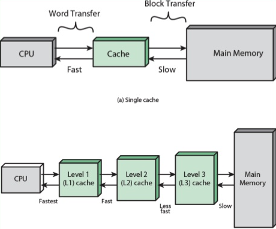
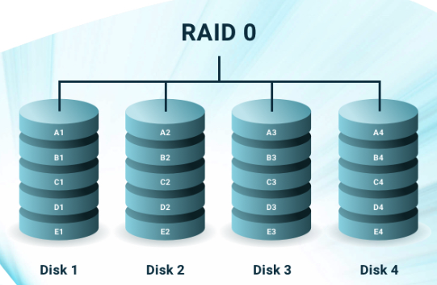
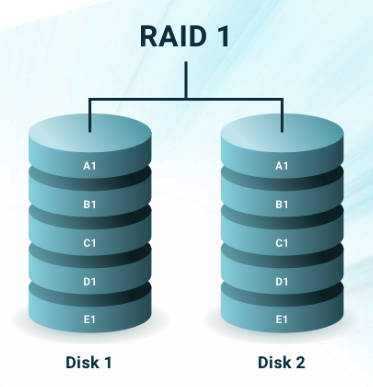
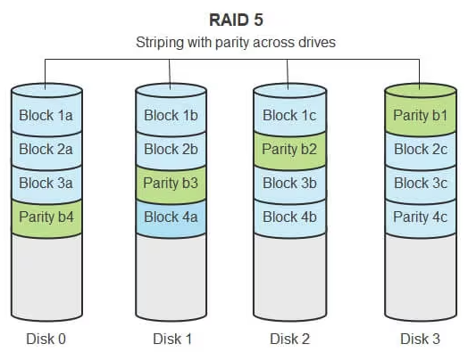
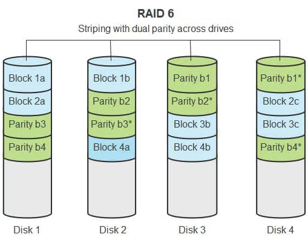

# 4. 메모리

이번 내용은 메모리의 하드웨어적 특징과 종류, 메모리의 2가지 주소 체계와 바이트 저장 순서에 대해 알아본다

## RAM

- 휘발성 저장장치

- 용량이 충분히 크면 보조기억장치로부터 많은 데이터를 가져와 미리 RAM에 저장할 수 있기 떄문에 많은 프로그램을 동시에 실행하는데 유리

- 임의접근(= 직접 접근) : 저장된 요소에 순차적으로 접근할 필요없이 임의의 위치에 곧장 접근 가능한 방식 -> 데이터에 접근하는 시간 동일

### 1. DRAM (Dynamic Ram)

- 시간이 지나면 저장된 데이터가 점차 사라지는 RAM

- 특징 : 소비전력이 낮고, 저렴하고 집적도가 높아 메모리를 대용량으로 설계하기에 용이하다.

#### 2. SRAM (Static RAM)

- 시간이 지나도 저장된 데이터가 사라지지 않는 RAM, 전원이 공급되지 않으면 저장된 내용이 소실되긴 한다.

- 속도가 빨라야하는 저장장치 -> 캐시 메모리에 사용된다..

### 3. SDRAM (Synchronous Dynamic RAM)

- 클럭 신호와 동기화된, 보다 발전된 형태의 DRAM

- 클럭에 맞춰 작동하여 정보를 주고받을 수 있는 DRAM

### 4. DDR SDRAM

- 대역폭을 넓혀 속도를 빠르게 만든 SDRAM

- 대역폭 (data rate) : 데이터를 주고받을 길의 너비

- SDRAM보다 전송 속도가 2배 가량 빠르다.

## 메모리에 바이트를 밀어넣는 순서 - 빅엔디안, 리틀 엔디안

현대의 메모리는 대부분 데이터를 **바이트** 단위로 저장하고 관리한다.

- 빅 엔디안 (big endian) : 낮은 번지의 주소에 상위 바이트부터 저장하는 방식

- 리틀 엔디안 (little endian) : 낮은 번지의 주소에 하위 바이트부터 저장하는 방식

## 캐시 메모리

CPU의 연산 속도가 아무리 빨라도 메모리에 접근하는 속도가 느리면 CPU의 빠른 연산 속도는 아무 효용이 없다.

그래서 등장한 저장장치가 **캐시 메모리**이다.

- CPU의 연산 속도와 메모리 접근 속도의 차이를 줄이기 위해 탄생한 저장장치

- CPU와 메모리 사이에 위치한 **SRAM 기반의 저장장치**

- CPU가 매번 메모리에 왔다 갔다하는 시간이 오래 걸리므로, 메모리에서 CPU가 사용할 일부 데이터를 미리 캐시 메모리로 가져와 활용하는 것이다.

  

- 크기 : L1 < L2 < L3

- 속도 : L3 < L2 < L1

- L1 캐시 메모리 구성 : L1l 캐시 (명령어만 저장) & L1D 캐시 (데이터만 저장)

## 캐시 히트와 캐시 미스

캐시 메모리는 메모리보다 용량이 작기 때문에 메모리에 있는 모든 내용을 캐시 메모리에 가져와 저장할 수 없다.

캐시 메모리는 CPU가 사용할 법한 것을 저장한다.

- 캐시 히트 : 캐시 메모리가 예측하여 저장한 데이터가 CPU에 의해 실제로 사용되는 경우

- 캐시 미스 : CPU가 메모리로부터 필요한 데이터를 직접 가져와야 하는 경우

- 캐시 적중률 : 캐시 히트 횟수 / (캐시 히트 횟수 + 캐시 미스 횟수)

## 참조 지역성의 원리

캐시 메모리의 이점을 제대로 활용하려면 CPU가 사용할 법한 데이터를 제대로 예측해서 캐시 적중률을 높여야한다.

캐시 메모리는 **참조 지역성**의 원리에 따라 메모리로부터 가져올 데이터를 결정한다.

- 시간 지역성 : CPU는 최근에 접근했던 메모리 공간에 다시 접근하려는 경향이 있다. (예 : 변수)

- 공간 지역성 : CPU는 접근한 메모리 공간의 근처에 접근하려는 경향이 있다. (예 : 배열)

## 캐시 메모리의 쓰기 정책과 일관성

CPU가 캐시 메모리에 데이터를 쓸 때는 캐시 메모리에 새롭게 쓰여진 데이터와 메모리 상의 데이터가 일관성을 유지해야 한다.

### 즉시 쓰기 (write-through)

- 캐시 메모리와 메모리에 동시에 쓰는 방법

- 장점 : 메모리를 항상 최신 상태로 유지하여 캐시 메모리와 메모리 간의 일관성이 깨지는 상황 방지

- 단점 : 데이터를 쓸 때마다 메모리를 참조해야 하므로 버스의 사용 시간과 쓰기 시간이 늘어난다.

  결국 메모리 접근을 최소화하기 위해 캐시 메모리를 만들었는데, 데이터를 쓸 때마다 메모리와 캐시 메모리에 동시에 접근해야 한다면 캐시 메모리를 둔 효율이 떨어진다.

### 지연 쓰기 (write-back)

- 캐시 메모리에만 값을 써 두었다가 추후 수정된 데이터를 한 번에 메모리에 반영하는 방법

- 장점 : 메모리 접근 횟수를 줄일 수 있어 즉시 쓰기 방식에 비해 속도는 더 빠르다.

- 단점 : 메모리와 캐시 메모리 간의 일관성이 깨질 수 있다.

캐시 메모리와 메모리 간의 불일치만 해결해야 하는 것이 아니다.

때로는 다른 코어가 사용하는 캐시 메모리와의 불일치도 발생할 수 있다.

자칫 각기 다른 코어가 서로 다른 데이터를 대상으로 작업할 수 있기 때문이다.

## 정리

캐시 메모리를 사용한다는 것

즉 캐싱을 한다는 것은 데이터 접근에 있어 어느 정도의 빠른 성능은 보장할 수 있지만,

그와 동시에 데이터의 일관성을 유지하기 위한 책임이 따르는 방식이다.

캐시와 캐시 메모리를 활용하는 이유는 **자주 사용할 법한 대상을 가까이 위치시킴으로써 성능 향상을 꾀한다.**

캐싱을 할 때는 언제나 캐시된 데이터와 원본 데이터 간의 불일치와 데이터의 일관성을 고려해야한다.

# 5. 보조기억장치와 입출력장치

보조기억장치는 메모리의 휘발성을 보완하는 동시에 메모리보다 큰 저장 공간을 제공한다.

이번에는 보조기억장치에 저장된 정보를 안정적이고 안전하게 관리하는 방법인 **RAID**와 보조기억장치를 포함한 다양한 입출력장치가 입출력을 수행하는 방법도 알아본다.

## RAID

보조기억장치 : 하드 디스크 드라이브 (HDD), 플래시 메모리 기반 저장장치 (SSD)

보조기억장치의 본분

- 전원이 꺼져도 데이터를 안전하게 보관하는 것

- CPU가 필요로 하는 정보를 조금이라도 빠른 성능으로 메모리에게 전달하는 것

즉, 보조기억장치의 데이터를 안전하고 빠르게 다룰 수 있는 방법이 중요하다.

이를 위해 사용할 수 있는 기술이 바로 **RAID**이다.

RAID (Redundant Array of Independent Disks)는 데이터의 **안전성** 혹은 **성능**을 확보하기 위해

여러개의 독립적인 보조기억장치를 마치 **하나의 보조기억장치처럼 사용**하는 기술이다.

RAID를 구성하는 방법을 **RAID 레벨**이라고 표현한다.

### RAID0

- 데이터를 여러 보조기억장치에 **단순하게 나누어 저장하는 구성 방식**이다.

데이터가 하드디스크의 개수만큼 나뉘어 저장되어 있다.

스트라입 (stripe) : 마치 줄무늬처럼 분산되어 저장된 데이터

스트라이핑(striping) : 그림처럼 분산하여 저장하는 동작

- 장점 : 빠른 입출력 속도. 데이터를 한번에, 동시에 읽고 쓸 수 있다.

- 단점 : 저장된 정보가 안전하지 않다. 그림 속 Disk 1에 문제 생기면 나머지 Disk에 저장된 데이터도 불안전한 데이터가 된다.

### RAID1

- **완전한 복사본을 만들어 저장하는 구성 방식**, **미러링** 이라고 부른다.

- 장점 : 복구가 간단하고 안전성이 높다.

- 단점 : 어떤 데이터를 쓸 때, 원본과 복사본 2곳에 써야하기 때문에 RAID0보다 쓰기 속도가 느려진다. 복사본이 저장된 크기만큼 사용 가능한 용량이 적어진다.

### RAID4

- **패리티 정보를 저장하는 디스크를 따로 두는 구성 방식**

- 패리티(parity) : 오류를 검출할 수 있는 정보

- 장점 :

  RAID4를 통해 오류 검출용 장치를 따로 두면 RAID1에 비해 적은 하드 디스크로도 안전하게 데이터를 보관할 수 있다.

- 단점 :

  패리티를 저장하는 장치에 병목 현상이 발생한다.

  어떤 새로운 데이터가 저장될 때마다 패리티를 저장하는 디스크에도 데이터를 쓰게 될 때 해당 디스크가 병목 지점이 될 수 있다.

### RAID5

- **패리티를 분산하여 저장하는 구성 방식**

패리티를 분산 저장하면 RAID4의 단점인 병목 현상을 보완할 수 있다.

### RAID6

- 구성은 기본적으로 RAID5와 같지만, **서로 다른 2개의 패리티를 두는 구성 방식**

- 오류를 검출하고 복수할 수 있는 수단이 2개가 생긴 셈이다.

- RAID4나 5보다 안정성이 높지만, 새로운 정보를 저장할 때마다 함께 저장할 패리티가 2개이므로 RAID5에 비해 쓰기 속도가 느리다.

### 결론

RAID 레벨마다 각기 다른 장단점이 있기 때문에 어떤 상황에서 무엇을 최우선으로 원하는지에 따라

최적의 RAID 레벨은 달라질 수 있다. 각 특징을 알고 있는게 중요!
