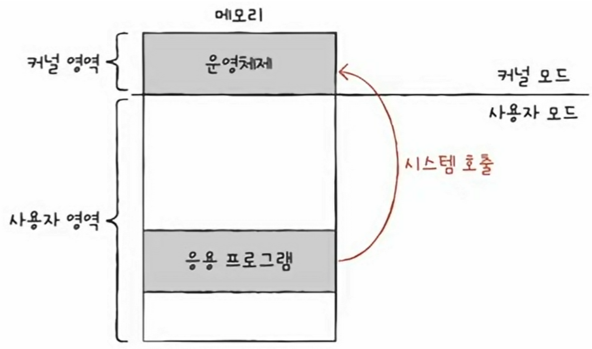
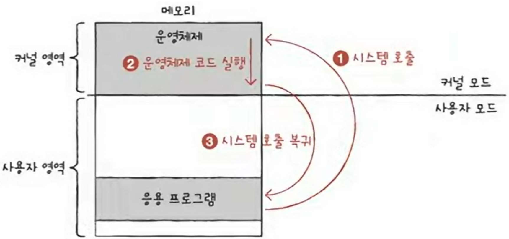
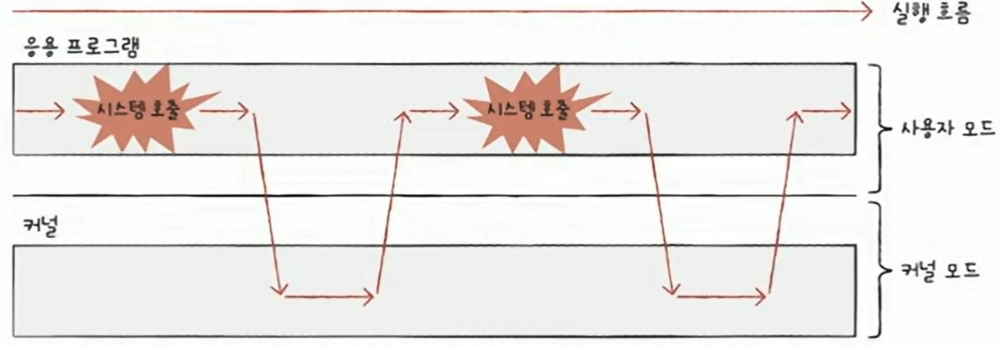
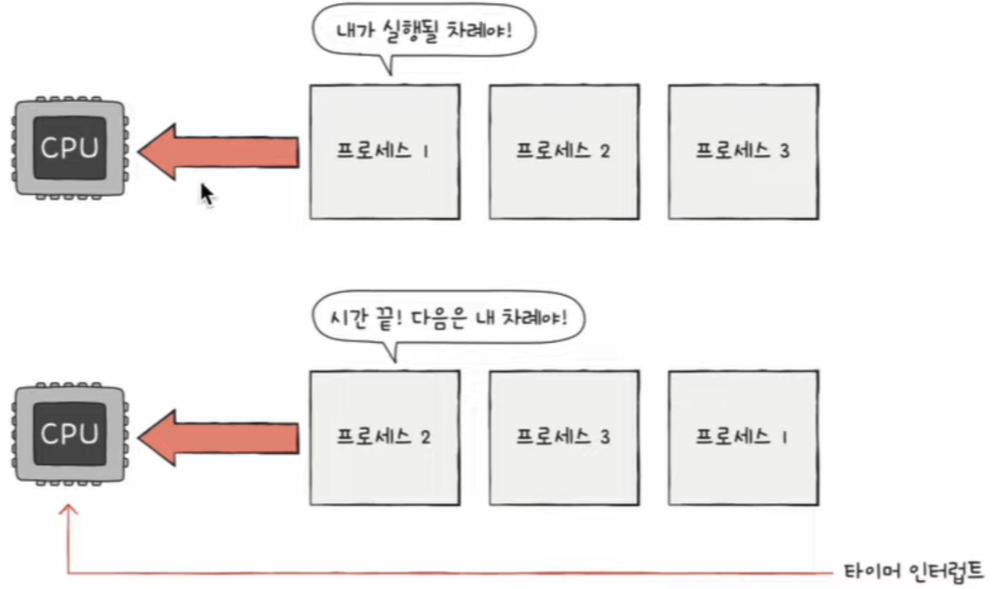
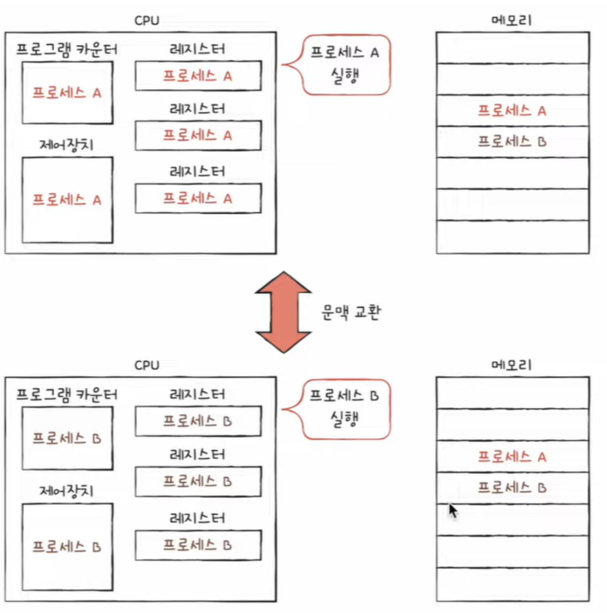
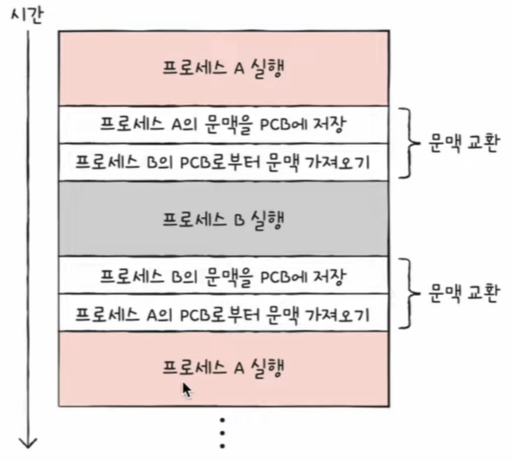

# 1. 운영체제의 큰 그림

커널 (kernel) : 운영체제의 핵심 기능을 담당하는 부분 (심장, 엔진)

운영체제의 2가지 핵심 기능

1. 자원 할당 및 관리

   - CPU 관리 : CPU 스케줄링

   - 메모리 관리 : 가상 메모리

   - 파일/디렉터리 관리 : 파일 시스템

2. 프로세스 및 스레드 관리

   - 프로세스와 스레드

   - 동기화와 교착 상태

## 운영체제의 역할

자원 : 프로그램 실행에 마땅히 밀요한 요소 (데이터, 부품)

운영체제는 응용프로그램을 대신하여 컴퓨터 부품(CPU, 메모리, 보조기억장치 등)에 접근하고, 각 부품들이 효율적으로 사용되도록 관리한다. 또한 응용 프로그램에게 자원을 할당한다.

### CPU 관리: CPU 스케줄링

운영체제는 실행 중인 모든 프로그램들이 공정하고 합리적으로 CPU를 할당받도록 CPU의 할당 순서와 사용 시간을 결정한다.

- 기본 개념 : 우선순위, 스케줄링 큐, 선점형과 비선점형

- CPU 스케줄링 알고리즘

- 리눅스 CPU 스케줄링

### 메모리 관리: 가상 메모리

운영체제는 새롭게 실행하는 프로그램을 메모리에 적재하고, 종료된 프로그램을 메모리에서 삭제한다. 동시에 낭비되는 메모리 용량이 없도록 효율적으로 관리해야한다. 이를 위해 실제 물리적인 메모리 크기보다 더 큰 메모리를 이용할 수 있도록 하는 **가상 메모리** 기술을 활용한다.

### 파일/디렉터리 관리: 파일 시스템

운영체제는 보조기억장치를 효율적으로 관리하기 위해 파일 시스템을 활용한다.

파일 시스템 : 보조기억장치 내의 정보를 파일 및 폴더 단위로 접근 및 관리할 수 있도록 만드는 운영체제 내부 프로그램

### 프로세스 및 스레드 관리

- 프로세스 : 실행 중인 프로그램

- 스레드 : 프로세스를 이루는 실행의 단위

운영체제는 프로세스에 필요한 자원을 할당하고,

스레드는 프로세스가 할당받은 자원을 이용해 프로세스의 작업을 수행한다.

- 프로세스를 이루는 스레드가 둘 이상인 경우, 동일한 작업을 동시에 실행할 수 있다.

- 같은 프로그램이라도 여러번 실행하면 별도의 프로세스가 될 수 있다.

## 시스템 콜과 이중 모드

운영체제는 메모리 내의 **커널 영역**이라는 공간에 따로 적재되어 실행된다.

**사용자 영역** : 커널 영역 외에 사용자 응용 프로그램이 적재되는 공간

운영체제의 기능을 제공받기 위해서는 커널 영역에 적재된 운영체제 코드를 실행해야한다.

(사용자) 응용 프로그램 (웹 브라우저, 게임 등) 은 운영체제와 달리 CPU, 메모리와 같은 자원에 직접 접근하거나 조작할 수 없다.

특정 자원에 접근하거나 조작하는 운영체제 코드를 실행해야한다.

### 응용 프로그램은 어떻게 운영체제의 코드를 실행할 수 있을까?

응용 프로그램은 시스템 콜 (system call)을 호출하여 운영체제 코드를 실행할 수 있다.

시스템 콜 : 운영체제의 서비스를 제공받기 위한 인터페이스, 호출 가능한 함수의 형태

---

### 컴퓨터 내부에서 시스템 콜이 호출된 후 수행되는 작업 과정

**소프트웨어 인터럽트** 발생 -> CPU의 **커널 모드** 전환 -> 운영체제 코드 실행 -> **사용자 모드**로 재전환

소프트웨어 인터럽트 (시스템 콜) : 자원 접근 명령어에 의해 발생하는 인터럽트

### 시스템 콜의 작동 순서

1. 사용자 영역을 실행하는 과정에서 시스템 콜이 호출되면 CPU는 현재 수행 중인 작업을 백업

2. 커널 영역 냉의 인터럽트를 처리하기 위한 코드(시스템 콜을 구성하는 코드)를 실행

3. 다시 사용자 영역의 코드 실행을 재개

사용자 모드

- 운영체제 서비스를 제공 받을 수 없는 실행 모드

- 커널 영역의 코드를 실행할 수 없는 모드

커널 모드

- 운영 체제 서비스를 제공받을 수 있는 실행 모드

사용자 모드로 실행되는 명령어는 실수로라도 자원에 접근할 수 없지만,

커널 모드로 명령어를 실행하면 자원에 접근하는 명령어를 비롯한 모든 명령어 실행 가능하다.

일반적으로 응용 프로그램은 실행 과정에서 운영체제 서비스들을 매우 빈번하게 이용한다.

그 과정에서 빈번하게 시스템 호출을 발생시키고, 사용자모드와 커널 모드를 오가며 실행된다.

# 2. 프로세스와 스레드

## 프로세스

- 프로그램은 실행되기 전까지는 그저 보조기억장치에 있는 데이터 덩어리

- 보조기억장치에 저장된 프로그램을 메모리에 적재하고 실행하는 순간 프로세스가 된다.

## 프로세스의 종류

- Foreground Process : 사용자가 볼 수 있는 공간에서 실행되는 프로세스

- Background Process : 사용자가 볼 수 없는 공간에서 실행되는 프로세스

백그라운드 프로세스 중에서 사용자와 직접 상호작용할 수 있는 백그라운드 프로세스도 있지만, 사용자와 상호작용하지 않는 백그라운드 프로세스도 있다.

**데몬 (demon)** : 사용자와 별다른 상호작용 없이 주어진 작업만 수행하는 특별한 백그라운드 프로세스. 윈도우에서는 **서비스**라고 부른다.

## 프로세스의 정보가 저장되는 메모리 영역 중 사용자 영역

### 1. 코드 영역

- 실행할 수 있는 코드, 텍스트 영역

- CPU가 읽고 실행할 명령어가 담겨 있어서 쓰기가 금지된 영역 (read-only)

- 정적 할당 영역(크기가 고정된 영역)

### 2. 데이터 영역

- 프로그램이 실행되는 동안 유지될 데이터 저장되는 공간

- 예) 정적 변수, 전역 변수

- 정적 할당 영역(크기가 고정된 영역)

### 3. 힙 영역

- 프로그래머가 직접 할당할 수 있는 저장 공간

- 힙 영역에 메모리 공간을 할당했다면 메모리 반환은 필수!

- 메모리 반환 안하면 메모리 누수 (memory leak) 문제 초래

- 가비지 컬렉션(garbage collection)으로 문제 해결

- 동적 할당 영역 (크키가 가변적인 영역)

### 4. 스택 영역

- 데이터가 일시적으로 저장되는 공간

- 예) 매개변수, 지역 변수, 함수 복귀 주소

**스택 트레이스**

- 특정 시점에 스택 영역에 저장된 함수 호출 정보

- 문제의 발생 지점을 추적할 수 있어, 디버깅에 매우 유용

## PCB와 문맥 교환

모든 프로세스는 실행을 위해 CPU를 필요로 하지만, CPU 자원은 한정되어 있다.

따라서 프로세스들은 돌아가며 한정된 시간만큼만 CPU를 이용한다.

- 자신의 차례에 정해진 시간만큼 CPU를 이용

- 타이머 인터럽트(타임 아웃 인터럽트)가 발생하면 차례 양보

- 타이머 인터럽트 : 클럭 신호를 발생시키는 장치에 의해 주기적으로 발생하는 하드웨어 인터럽트

운영체제는 빠르게 번갈아 수행되는 프로세스의 실행 순서를 관리하고, 프로세스에 CPU를 비롯한 자원을 배분한다,

이를 위해 운영체제는 PCB(프로세스 제어 블록)을 이용한다.

### PCB (Process Control Block)

- 프로세스 관련 정보를 저장하는 자료 구조

- 마치 상품에 달린 태그와 같은 정보

- 운영체제는 수많은 프로세스들 사이에서 PCB로 특정 프로세스를 식별하고 해당 프로세스를 처리하는 데 필요한 정보를 판단

- 프로세스 생성 시 커널 영역에 PCB를 생성, 종료 시 PCB를 폐기

- 담기는 정보

  - 프로세스 ID : 특정 프로세스를 식별하기 위해 부여하는 고유번호

  - 레지스터 값 : 프로세스는 자신의 차례가 돌아오면 이전까지 작업했던 내용(레지스터 중간값)을 복구한다. 작업을 모두 마치지 못하고 CPU를 반납해야 한다면 이전까지 작업 내용을 레지스터에 백업한다.

  - 프로세스 상태 : 입출력 장치를 기다리는지, CPU를 이용중인지

  - CPU 스케줄링 정보 : 프로세스가 언제, 어떤 순서로 CPU를 할당받을 지에 대한 정보

  - 메모리 관련 정보 : 프로세스가 어느 주소에 저장되어 있는지에 대한 정보

  - 사용한 파일 및 입출력장치 관련 정보 : 어떤 입출력 장치가 이 프로세스에 할당되었는지, 어떤 파일들을 열었는지에 대한 정보

### 문맥 교환

한 프로세스(프로세스 A)에서 다른 프로세스(프로세스 B)로 실행 순서가 넘어가면 기존에 실행되던 프로세스 A는 지금까지의 중간 정보를 백업한다.

백업하는 정보로는 프로그램 카운터를 비롯한 각종 레지스터 값, 메모리 정보, 열었던 파일, 사용한 입출력 장치 등이 있다.

이러한 중간 정보, 즉 하나의 프로세스 수행을 재개하기 위해 기억해야 할 정보를 문맥(context)이라고 한다.

PCB에 기록되는 정보들을 문맥이라고 봐도 무방하다.

실행 문맥을 잘 기억해 두면 언제든 해당 프로세스의 실행을 재개할 수 있기 때문에 프로세스가 CPU를 사용할 수 있는 시간이 다 되거나 예기치 못한 상황이 발생하여 인터럽트가 발생하면 운영체제는 해당 프로세스의 PCB에 문맥을 백업한다. 이후 다시 자신의 차례가 오면 문맥을 복구한다.

이러한 과정을 프로세스끼리 반복한다면 그것이 문맥 교환이다.

정리하자면 기존 프로세스의 문맥을 PCB에 백업하고, 새로운 프로세스를 실행하기 위해 문맥을 PCB로부터 복구하여 새로운 프로세스를 실행하는 것을 **문맥 교환**이라고 한다.

문맥 교환은 여러 프로세스가 끊임없이 빠르게 번갈아 가며 실행되는 원리이다.

문맥 교환이 자주 일어나면 프로세스는 그만큼 빨리 번갈아 수행되기 때문에 우리들의 눈에는 프로세스들이 동시에 실행되는 것처럼 보인다.

문맥 교환을 너무 자주하면 오버헤드가 발생할 수 있기 때문에 문맥 교환이 자주 일어난다고 해서 반드시 좋은 건 아니다.
